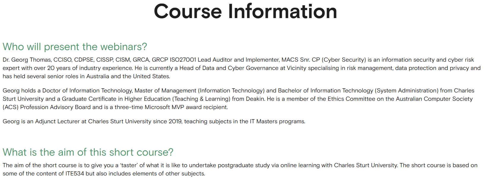
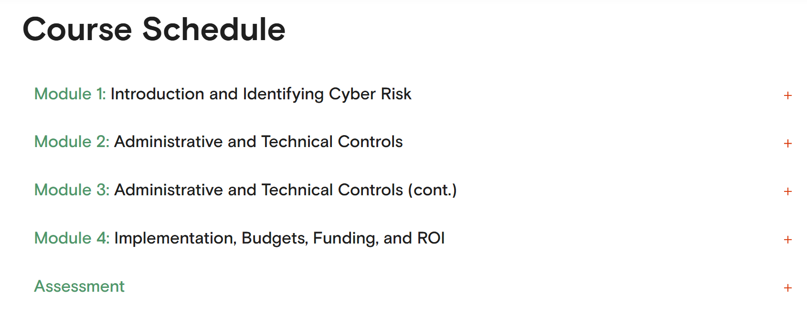

# 🛡️ Cyber Defence Strategies – IT Masters

    

This repository contains **notes, labs, frameworks, playbooks, research case studies, and certificate of completion** for the *Cyber Defence Strategies* short course by IT Masters. The program provides a solid foundation in **network defence, threat detection, incident response, and blue-team operations**.

---

## 📚 Notes
- 📄 [01-introduction-to-cyber-defence.md](./notes/01-introduction-to-cyber-defence.md) – Introduction to cyber defence concepts  
- 📄 [02-threat-landscape.md](./notes/02-threat-landscape.md) – Current threat landscape overview  
- 📄 [03-defence-in-depth.md](./notes/03-defence-in-depth.md) – Defence-in-depth strategies  
- 📄 [04-network-defence-strategies.md](./notes/04-network-defence-strategies.md) – Network security techniques  
- 📄 [05-endpoint-and-application-defence.md](./notes/05-endpoint-and-application-defence.md) – Endpoint & application security  

---

## 🧪 Labs
- 💻 [firewall-configuration-lab.md](./labs/firewall-configuration-lab.md) – Firewall setup & configuration  
- 💻 [ids-ips-lab.md](./labs/ids-ips-lab.md) – IDS/IPS detection lab  
- 💻 [incident-response-simulation.md](./labs/incident-response-simulation.md) – Simulated incident response exercise  
- 💻 [threat-hunting-lab.md](./labs/threat-hunting-lab.md) – Threat hunting practice lab  

---

## 📋 Frameworks
- 📄 [nist-cybersecurity-framework.md](./frameworks/nist-cybersecurity-framework.md) – NIST CSF overview & usage  
- 📄 [mitre-attack-framework.md](./frameworks/mitre-attack-framework.md) – MITRE ATT&CK framework & techniques  
- 📄 [iso-27001.md](./frameworks/iso-27001.md) – ISO/IEC 27001 controls & implementation  
- 📄 [cobit-framework.md](./frameworks/cobit-framework.md) – COBIT governance framework  

---

## 🔬 Extras
- 📑 [case-studies.md](./extras/case-studies.md) – Real-world case studies  
- 📆 [timeline.md](./extras/timeline.md) – Timeline of major attacks & defences  
- 📘 [resources.md](./extras/resources.md) – Additional learning materials  

---

## 📖 Docs
- 📘 [glossary.md](./docs/glossary.md) – Cybersecurity & SOC glossary  
- 📘 [index.md](./docs/index.md) – Course overview & objectives  
- 📘 [references.md](./docs/references.md) – References & external sources  
- 📘 [roadmap.md](./docs/roadmap.md) – Learning roadmap  
- 📘 [syllabus.md](./docs/syllabus.md) – Full course syllabus  

---

## 📸 Screenshots

| Step | Screenshot |
|--------------------------|------------|
| 🏫 Course Information    |  |
| 📅 Course Schedule       |  |

---

## 📜 Certificate
🎓 [Cyber Defence Strategies Certificate](./cert/Cyber%20Defence%20Strategies.pdf)

---

## 📝 Personal Review
This course strengthened my **blue-team and cyber defence knowledge**. The hands-on labs covering **firewalls, IDS/IPS, incident response, and threat hunting** provided practical skills for monitoring, detecting, and responding to cyber threats. It’s a solid introduction for anyone aiming to **build expertise in cybersecurity operations and defensive strategies**.

---

## ✍️ Author
**Thành Danh** – Red Team Learner & Security Researcher  

- GitHub: [@ngvuthdanhh](https://github.com/ngvuthdanhh)  
- Email: ngvu.thdanh@gmail.com  

---

## 📄 License
This project is licensed under the **MIT License**. See [LICENSE](./LICENSE) for full details.  
© 2025 ngvuthdanhh. All rights reserved.
